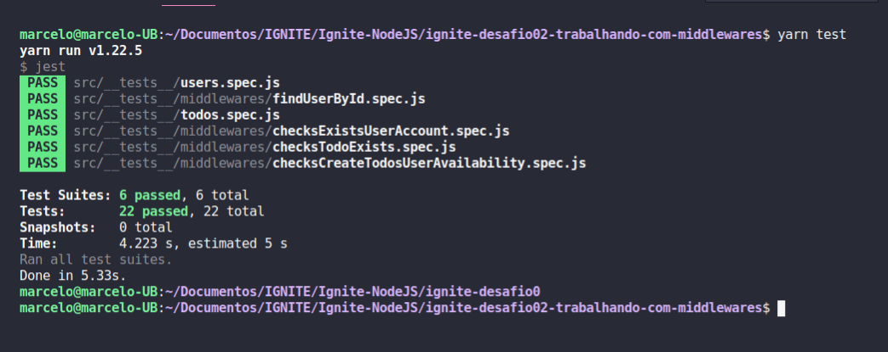

# ignite-desafio02-trabalhando-com-middlewares

Desafio 02 - Trabalhando com middlewares

<h1 align="center">
    
</h1>

Nesse desafio foi criado uma funcionalidade para trabalhado mais a fundo com middlewares no Express. Para treinar o que foi aprendido até agora na trilha Node.js!. 

Essa e uma aplicação que permiti a criação de um usuário com `name` e `username`, bem como fazer o CRUD de *todos*:

- Criar um novo *todo*;
- Listar todos os *todos*;
- Alterar o `title` e `deadline` de um *todo* existente;
- Marcar um *todo* como feito;
- Excluir um *todo*;

Testes dos middlewares

- Should be able to find user by username in header and pass it to request.user
- Should not be able to find a non existing user by username in header
- Should be able to let user create a new todo when is in free plan and have less than ten todos
- Should not be able to let user create a new todo when is not Pro and already have ten todos
- Should be able to let user create infinite new todos when is in Pro plan
- Should be able to put user and todo in request when both exits
- Should not be able to put user and todo in request when user does not exists
- Should not be able to put user and todo in request when todo id is not uuid
- Should not be able to put user and todo in request when todo id is not uuid
- Should be able to find user by id route param and pass it to request.user
- Should not be able to pass user to request.user when it does not exists

Aqui teremos uma breve descrição do que cada middleware deve fazer

### checksExistsUserAccount

Esse middleware é responsável por receber o username do usuário pelo header e validar se existe ou não um usuário com o username passado. Caso exista, o usuário deve ser repassado para o request e a função next deve ser chamada.

### checksCreateTodosUserAvailability

Esse middleware deve receber o **usuário** já dentro do request e chamar a função next apenas se esse usuário ainda estiver no **plano grátis e ainda não possuir 10 *todos* cadastrados** ou se ele **já estiver com o plano Pro ativado**. 

### checksTodoExists

Esse middleware deve receber o **username** de dentro do header e o **id** de um *todo* de dentro de `request.params`. Você deve validar o usuário, validar que o `id` seja um uuid e também validar que esse `id` pertence a um *todo* do usuário informado.

Com todas as validações passando, o *todo* encontrado deve ser passado para o `request` assim como o usuário encontrado também e a função next deve ser chamada.

### findUserById

Esse middleware possui um funcionamento semelhante ao middleware `checksExistsUserAccount` mas a busca pelo usuário deve ser feita através do **id** de um usuário passado por parâmetro na rota. Caso o usuário tenha sido encontrado, o mesmo deve ser repassado para dentro do `request.user` e a função next deve ser chamada.

https://www.notion.so/Desafio-02-Trabalhando-com-middlewares-4f89bf538c2e4ee291382b92bdc36790
